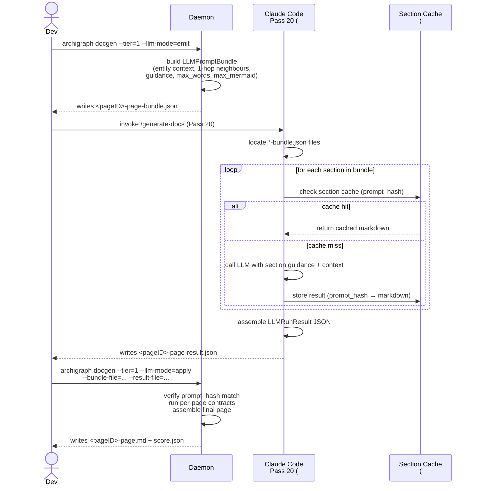

# Docgen LLM Mode — 5-Tier Ladder and Iteration Workflow

> **Ticket chain:** #1813 (E schema), #1816 (A schema), #1819 (B+C emit), #1821 (D apply), #1822 (F skill / Pass 20), **this doc: ticket G**.

This document explains the deterministic-tier docgen ladder, the LLM-mode
iteration loop, how to invoke the Claude Code skill (Pass 20), the section
cache (ticket E, in flight), and concrete command recipes for common
workflows.

---

## 1. The 5-Tier Docgen Ladder

Archigraph docgen is built around a progressive-validation ladder. Each tier
is a strict superset of the tier below it — you can always run a higher tier,
but you must clear the lower ones first before trusting the output.

The tiers are **deterministic**: they do not call an external LLM. They build
fully-resolved context stubs from the local graph. The LLM prose-fill layer is
an optional overlay applied on top of any tier's output via `--llm-mode`.

| Tier | Scope | Key contracts | LLM fills prose? | Smoke wall time |
|------|-------|---------------|-----------------|-----------------|
| **0** | Single section for one seed entity | Word budget, mermaid budget ≤ 3/section, `score.json` emitted | Optional (emit/apply loop) | < 30 s |
| **1** | Full multi-section page for one seed entity | All Tier 0 + anchor-ID determinism, internal link resolution, page mermaid ≤ 9 total | Optional (emit/apply loop) | < 120 s |
| **2** | Coherent slice: seed entity + top-N dependents (~5 pages) | All Tier 1 per page + cross-page: no duplicate flows, cross-page anchor links consistent, slice mermaid ≤ 15 | Not yet wired | < 10 min |
| **3** | Full doc set for one repo | All Tier 2 per slice + repo-level: every page-worthy entity covered, no two pages claim same entity, repo index generated | Not yet wired | < 20 min |
| **4** | Full doc set for all repos in a group | All Tier 3 per repo + cross-repo: all cross-repo link targets resolve, group index generated, no flow described in 2+ repos | Not yet wired | < 60 s (parallel, deterministic stubs) |

**When to use which tier:**

- **Tier 0** — prompt-quality iteration. You edited a prompt template and want
  a fast feedback loop. Edit → run Tier 0 → read `score.json` diff → repeat.
- **Tier 1** — per-page validation. You want to verify that one entity's full
  page passes anchor + link + mermaid contracts before wiring LLM prose.
- **Tier 2** — slice coherence. You want to validate that related pages link
  correctly and share no duplicate flow diagrams.
- **Tier 3** — pre-push repo check. Run before merging a prompt change to
  confirm no regressions across a whole repo's doc set.
- **Tier 4** — group regression test. Run before a docgen release to validate
  the full multi-repo group end-to-end.

---

## 2. The LLM-Mode Iteration Loop

LLM mode is currently wired for **Tier 0 and Tier 1** (tickets #1819 + #1821).
It turns the deterministic stubs into LLM-filled prose via a three-step loop:

```
 daemon side                 orchestrator side (Claude Code)      daemon side
┌─────────────┐             ┌──────────────────────────────┐    ┌─────────────┐
│  --llm-mode │             │  /generate-docs Pass 20       │    │  --llm-mode │
│    =emit    │ ──bundle──► │  (skills/generate-docs)       │ ──►│    =apply   │
└─────────────┘             └──────────────────────────────┘    └─────────────┘
   Tier 0 or 1                  reads bundle, fills each           re-runs Tier
   writes bundle.json           section with LLM prose,            contracts,
   (self-contained,             writes result.json                 builds final
   no LLM call)                                                    page + score
```

### Sequence diagram



### Step-by-step

1. **Emit** — daemon reads the graph for your seed entity and writes a
   self-contained `*-page-bundle.json`. No LLM call yet. The bundle carries
   entity metadata, 1-hop neighbour briefs, section guidance text, word/mermaid
   budgets, and a `prompt_hash` (SHA-256 over version + section names + entity
   ID + graph node hash + guidance text). Source: `internal/docgen/llm_bundle.go`.

2. **Orchestrate** — Pass 20 of the `generate-docs` skill reads every bundle
   file, calls the LLM once per section, assembles an `LLMRunResult` JSON, and
   writes it next to the bundle. The pass is idempotent: it skips any bundle
   whose result file already exists with a matching `prompt_hash`.

3. **Apply** — daemon re-reads the bundle + result pair, verifies the
   `prompt_hash` matches, runs per-page contracts (mermaid budget, anchor IDs,
   internal link resolution), and writes the final `<pageID>-page.md` +
   `score.json`.

---

## 3. Claude Code Skill Integration (Pass 20 / #1822)

Pass 20 lives at `skills/generate-docs/prompts/20-llm-orchestrate.md`.
It is part of the `generate-docs` skill (`skills/generate-docs/SKILL.md`).

**Trigger phrases** that invoke Pass 20:

- "Fill the LLM bundle"
- "Run docgen in LLM mode"
- "Orchestrate the bundle"
- A `*-page-bundle.json` file exists and no matching `*-result.json` exists yet

**What Pass 20 does:**

1. Locates `*-bundle.json` files under the docs dir
   (`~/.archigraph/docs/<group>/`).
2. For each bundle, reads the `LLMPromptBundle` (schema `"1"`,
   source: `internal/docgen/llm_bundle.go`).
3. For each `sections[]` entry, calls the LLM with a grounded prompt built from:
   - `graph_context` (entity name/kind/qualified name/source file)
   - `neighbour_briefs` (1-hop neighbours with relationship labels)
   - `graph_context.source_window` (source excerpt, if populated)
   - `section.guidance` (section-specific instruction)
   - `section.stub_markdown` (deterministic stub — grounding context for LLM)
   - Word + mermaid budgets
4. Assembles `LLMRunResult` with `prompt_hash` copied from the bundle.
5. Writes `<pageID>-page-result.json` next to the bundle.
6. Invokes `archigraph docgen --tier=1 --llm-mode=apply ...`.

**Schema constraint:** `section_results` must contain exactly the same section
names as `bundle.sections` — no more, no fewer. The daemon's `ApplyResult`
rejects mismatches.

---

## 4. Section Cache (#1813 Ticket E — In Flight)

> **Status: in flight.** Ticket E implements `internal/docgen/llm_cache.go`.
> This section is a placeholder; update when E lands.

The section cache gives `--llm-mode=emit` a fast path on re-runs: if the
`prompt_hash` for a section has not changed since the last run (same graph
state, same guidance text, same entity), the orchestrator can return the cached
markdown and skip the LLM call entirely.

**Cache key:** `prompt_hash` (per-section SHA-256, see `llm_bundle.go` —
`sha256(version + "\x00" + section + "\x00" + entity_id + "\x00" + graph_node_hash + "\x00" + guidance_text)`).

**Expected behaviour after ticket E lands:**

- Pass 20 checks the cache before making any LLM call.
- A cache hit returns the stored markdown for that section/hash combination.
- A cache miss calls the LLM and populates the cache on success.
- Re-emitting a bundle after a graph change produces a new `prompt_hash` for
  affected sections only; unchanged sections still hit the cache.

This makes section-level prompt iteration extremely fast: edit one section's
guidance, re-emit, and only that section incurs an LLM call.

---

## 5. Examples and Recipes

### Recipe A — Iterate on a single section prompt

You edited the `capabilities` section template and want fast feedback:

```bash
# Step 1: emit a Tier 0 bundle for the section you are tuning.
archigraph docgen \
  --tier=0 \
  --group=<group> \
  --seed-entity=<entity-id> \
  --section=capabilities \
  --llm-mode=emit

# Output: ~/.archigraph/docs/<group>/.tier0-<ts>/<entity-id>-capabilities-bundle.json

# Step 2: run Pass 20 in Claude Code.
# In Claude Code:  /generate-docs
# (Pass 20 auto-detects the bundle and fills the section.)

# Step 3: apply.
archigraph docgen \
  --tier=0 \
  --llm-mode=apply \
  --bundle-file=~/.archigraph/docs/<group>/.tier0-<ts>/<entity-id>-capabilities-bundle.json \
  --result-file=~/.archigraph/docs/<group>/.tier0-<ts>/<entity-id>-capabilities-result.json

# Read score.json, compare word_count / mermaid_count / token_count_estimate
# against the previous run. Repeat from Step 1.
```

### Recipe B — Test a single page end-to-end

You want a full page for one entity with LLM prose, all contracts passing:

```bash
# Step 1: emit a Tier 1 bundle (full page, all sections).
archigraph docgen \
  --tier=1 \
  --group=<group> \
  --seed-entity=<entity-id> \
  --llm-mode=emit

# Step 2: fill via Pass 20 in Claude Code.
# /generate-docs  →  Pass 20 runs automatically.

# Step 3: apply and verify contracts.
archigraph docgen \
  --tier=1 \
  --llm-mode=apply \
  --bundle-file=~/.archigraph/docs/<group>/.tier1-<ts>/<entity-id>-page-bundle.json \
  --result-file=~/.archigraph/docs/<group>/.tier1-<ts>/<entity-id>-page-result.json

# Successful output:
#   tier1 apply complete
#   entity:     <name>
#   sections:   <N>
#   contract:   PASS
#   output:     ~/.archigraph/docs/<group>/.tier1-<ts>/<entity-id>-page.md
```

### Recipe C — Validate a coherent slice (no LLM)

You want to check cross-page contracts across ~5 related entities:

```bash
archigraph docgen \
  --tier=2 \
  --group=<group> \
  --seed-entity=<capability-entity-id> \
  --max-pages=5

# Reads slice-level score.json for cross-page contract violations.
# No LLM calls — deterministic stubs only.
```

### Recipe D — Full repo regression test (no LLM)

Before merging a prompt change, validate the whole repo's doc set:

```bash
archigraph docgen \
  --tier=3 \
  --group=<group> \
  --repo=<repo-slug>

# Writes ~/.archigraph/docs/<group>/.tier3-<ts>/<repo>/score.json
# Check: contract_violations == 0, every_entity_covered == true.
```

### Recipe E — Full group validation (no LLM)

Terminal validation across all repos in the group:

```bash
archigraph docgen \
  --tier=4 \
  --group=<group>

# Parallel repo runs (pool: MaxGroupConcurrency).
# Writes group-level score.json.
# Check: cross_repo_coverage_violations == 0, group_index_ok == true.
```

---

## 6. Schema Reference

The LLM bundle and result JSON schemas are defined in:

- **`internal/docgen/llm_bundle.go`** — `LLMPromptBundle`, `LLMSectionPrompt`,
  `LLMGraphContext`, `NeighbourBrief`, `LLMSectionResult`, `LLMRunResult`.
  Schema version constant: `LLMBundleVersion = "1"`.
- **`internal/docgen/llm_apply.go`** — `ApplyResult` and apply-time contract
  checks (hash verification, section coverage, page contracts).
- **`internal/docgen/tier0.go`** — `KnownSections` (canonical list of valid
  section names), `RunOpts`, `Score`.
- **`internal/docgen/tier1.go`** — `Tier1RunOpts`, `Tier1Score`,
  `MermaidBudgetPerSection` (3), `MermaidBudgetPage` (9).

**Known sections** (valid values for `--section` and `section_results[].section`):

```
overview, capabilities, flows, patterns, api,
reference-config, reference-dependencies, reference-deployment,
reference-scripts, reference-misc, module-readme, glossary, how-to-local-dev
```

### Bundle file naming

| Mode | Output path |
|------|-------------|
| Tier 0 emit | `~/.archigraph/docs/<group>/.tier0-<RFC3339>/<entity-id>-<section>-bundle.json` |
| Tier 1 emit | `~/.archigraph/docs/<group>/.tier1-<RFC3339>/<entity-id>-page-bundle.json` |
| Tier 1 result (written by Pass 20) | `~/.archigraph/docs/<group>/.tier1-<RFC3339>/<entity-id>-page-result.json` |
| Tier 1 final page (written by apply) | `~/.archigraph/docs/<group>/.tier1-<RFC3339>/<entity-id>-page.md` |

---

## 7. Troubleshooting

| Symptom | Cause | Fix |
|---------|-------|-----|
| `prompt_hash mismatch` | Bundle was re-emitted (graph changed) after result was written | Re-run Pass 20 against the new bundle |
| `section coverage error: bundle sections missing from result` | One or more section LLM calls failed silently | Re-generate the missing sections, rebuild result JSON |
| No `*-bundle.json` found | `--llm-mode=emit` not yet run | Run the emit step first (see Recipe A or B) |
| `unknown --llm-mode=<x>` | Invalid mode value | Valid values: `""` (default), `"emit"`, `"apply"` |
| Apply contract violation: mermaid budget | LLM emitted too many mermaid blocks | Check `max_mermaid` field in the bundle and reduce guidance aggressiveness |
| Apply contract violation: unresolved internal links | LLM generated `[text](#anchor)` links to non-existent headings | Pass 20 Step 3 note: do not add the section heading — the assembly machinery adds it |

---

## See Also

- `skills/generate-docs/SKILL.md` — full pass pipeline (Passes 0–20)
- `skills/generate-docs/prompts/20-llm-orchestrate.md` — Pass 20 full procedure
- `internal/docgen/llm_bundle.go` — schema source of truth
- `internal/docgen/llm_apply.go` — apply-time contract enforcement
- `docs/adrs/0015-residual-repair-agent-enrichment.md` — residual repair (ADR-0015)
- `docs/adrs/0018-agent-learned-patterns.md` — agent-learned patterns (ADR-0018)
