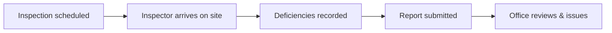

# <Journey name>

> One sentence: the goal the user accomplishes, end to end, across the product.
> Example: "A field inspector completes a building inspection and the office
> receives the report."

## Who and why

> The user type and the business goal. One short paragraph.

## The journey, step by step

> A NUMBERED list in plain language. Each step is something the *user* or *the
> system* does, described as a business action — never a function call. This is
> the heart of the page; a PM should follow it without help.

1. <Plain-language step — what the user does / sees / decides>.
2. <Next step>.
3. …

> If a simple business-step diagram helps, add one (≤ 8 boxes, business labels
> only). It must NOT be a sequence diagram of code. Otherwise omit it.

## What can go wrong

> Plain-language exceptions and edge cases the product handles (offline, missing
> data, rejected submission). No stack traces, no error class names.

## Where it touches the business

> Which capabilities and domain terms this journey exercises, each linked.

- Uses the [<Capability>](../capabilities/<slug>.md) capability.
- Involves [<Domain term>](../domain-glossary.md#<anchor>).

Where this came from (for engineers)

Assembled from the process flows / call chains documented in the technical tier
(possibly spanning multiple repos) and translated to a business narrative.
Last regenerated: <date>.

