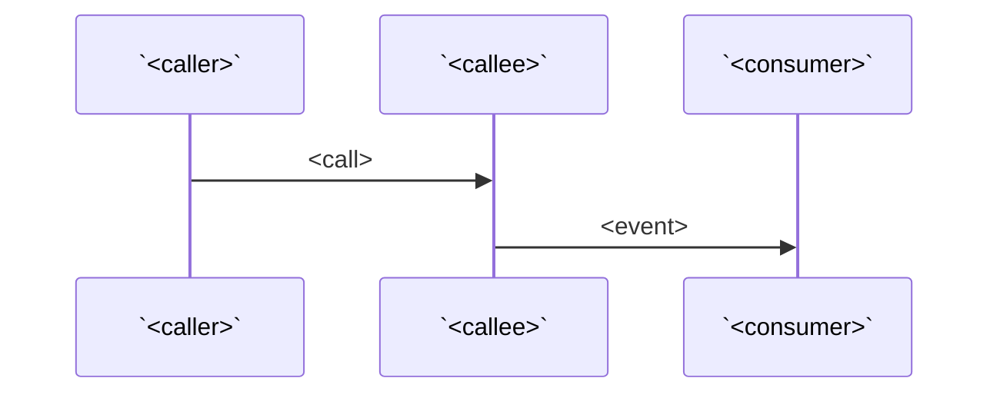

# `<module-slug>` flows

> Runtime flows that span more than one entity in this module, or that cross into other modules / other repos.

## How `<entity-A>` reaches `<entity-B>`

> Backticked-heading rule: both ends in backticks. This heading is the bridge node ADR-0007 relies on.

> Sequence — keep it short. Each step names participants in backticks.

1. `<caller>` invokes `<callee>` with `<arg>`.
2. `<callee>` writes `<event>` to `<channel>`.
3. `<consumer>` (in `<other module>` or `<other repo>:<module>`) handles `<event>`.

> Mermaid is optional. Skip it if prose is clearer.

## How `<event>` is handled

> Same shape as above for an event-driven flow.

## Failure modes

- `<failure>` — <where surfaced> — <retry/dead-letter behavior>.

## Where this is enforced

- `<file:line>` — <what the file does>.

## Where this is bypassed

> If the convention's `cross_cutting_pitfalls` lists known bypass points (e.g., management commands skipping middleware), list them here.
