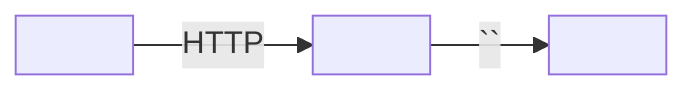

# `<group>` synthesis

> The group-level page. First doc a new engineer reads. First doc an external integrator reads. First doc an executive reads.

## What this group does

> One paragraph from `domain.md` — the mission line, expanded with concrete examples.

## Repos at a glance

| Repo | Role | Kind | Doc |
| ---- | ---- | ---- | --- |
| `<slug>` | <role> | service\|library\|infra | [overview](../../<slug>/docs/overview.md) |

## Runtime communication

> One or two paragraphs. Name the primary synchronous channel (REST, gRPC) and the primary asynchronous channel (queue, bus). Backtick every named entity.

> Mermaid is optional. If the diagram duplicates the prose, drop it.

## Dynamic couplings

> The ADR-0007 bridges. Each bullet names both ends in backticks and points at the doc page that bridges them.

- `<entity-A>` (in `<repo-A>`) ↔ `<entity-B>` (in `<repo-B>`) — bridged by [`<doc page>`](<path>).

## Cross-cutting summary

### Auth

> One paragraph. Link to [`cross-cutting/auth.md`](../cross-cutting/auth.md).

### Logging

> One paragraph. Link.

### Errors

> One paragraph. Link.

### Observability

> One paragraph. Link.

## Where to look next

- New engineer? Start with [`~/.archigraph/docs/<group>/<repo-slug>/overview.md`](../../~/.archigraph/docs/<group>/<repo-slug>/overview.md).
- On call? Start with [`cross-cutting/observability.md`](../cross-cutting/observability.md).
- Building an integration? Start with [`~/.archigraph/docs/<group>/<repo-slug>/reference/api.md`](../../~/.archigraph/docs/<group>/<repo-slug>/reference/api.md).

## Pending cross-repo links

> Pull from `cross-links.md`. Anything still `pending` after Pass 8 is listed here so a reader knows what is unconfirmed.
